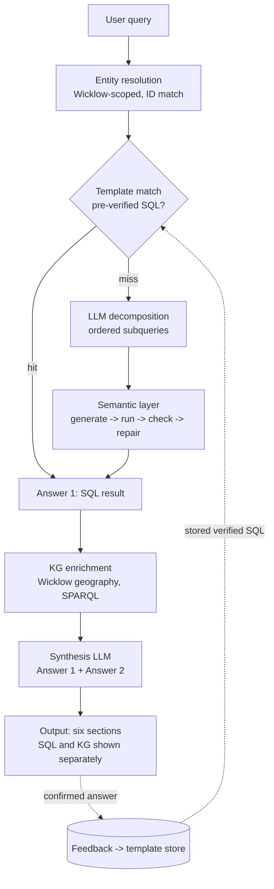

# Coolattin Estate Records Explorer — Ask Pipeline (RAG v2)
### Design & Operating Reference

**Branch:** `main` (merged from `feat/rag-v2-rebuild`)  
**Status as of 2026-06-21:** Core pipeline validated at v1.0-demo-freeze (2026-06-10). Azure deployment stabilised (CI/CD via OIDC + Oryx, gthread workers, security hardening). See `docs/11_demo_freeze.md` for full evaluation results.  
**Scope of this document:** how the rebuilt *retrieval* pipeline answers questions on the Ask page, the mechanisms that make its answers accurate, the current implementation status, and what must be true before it can be trusted in deployment.
**Out of scope:** the display layout is unchanged except for the specific fixes noted in §5 and §8.

---

## 1. What changed and why

The previous design routed every query through an intent classifier (`ANALYTICAL / RELATIONAL / COMPARATIVE / FALLBACK`). That router has been removed entirely. Routing now lives inside a **planner → executor → synthesizer** flow: an LLM decomposes the question, a semantic layer resolves it against SQL with self-correction, a knowledge-graph step adds geographic context, and a final LLM writes the answer.

The single most important reframing from the design work: **SQL and the knowledge graph never answer the same question**, so there is no contradiction to reconcile and no merge logic.

| Source | Owns | Examples |
|---|---|---|
| **SQLite (SQL)** | All *facts* | people, ages, gender, ships, migrants, workhouse records, population over time |
| **VRTI / GraphDB (SPARQL)** | County Wicklow *geography* only | townland / parish / county, location, what is notable about a place |

The knowledge graph only **enriches** a SQL answer with place context. It is never the source of factual record data.

---

## 2. Core invariants (the rules that keep answers accurate)

1. **SQL owns facts; SPARQL owns Wicklow geography.** Their outputs are kept separate end to end and never merged in the result.
2. **Identity is by surrogate ID, never by name.** Every townland/person filter uses a resolved `vrti_id` (or DB surrogate key). No `LIKE 'Cool%'` matching — that is what caused Coolattin to pull Cooly/Coolboy.
3. **No silent degradation.** Every fallback, partial result, empty result, or skipped agent is logged and surfaced. A component is never allowed to *appear* to work while quietly failing.
4. **Deterministic where possible, self-correcting where not.** Verified templates and computed aggregates are deterministic; free-form SQL is generated in a bounded self-correcting loop.
5. **Everything is County Wicklow only** — townland lists, KG queries, and the all-townlands overview.
6. **Empty means empty, honestly.** When the data genuinely has no answer, the response says so and explains *why* from the record context; it never fabricates and never returns a raw error dressed up as "not available".

---

## 3. End-to-end flow



The chain is **sequential**: the semantic layer produces **Answer 1** (facts), the KG step then produces **Answer 2** (geography), and the synthesis LLM combines them. A template hit skips decomposition and generation and goes straight to a verified SQL result.

---

## 4. Stage-by-stage

### 4.1 Entity resolution — `entity_resolver.py`
Resolves townland and person mentions to surrogate IDs, scoped to County Wicklow. Hardening applied: symmetric `UPPER` normalisation; the county field is a **scoring signal**, not a hard filter; a non-Wicklow candidate is penalised (0.7×) and low-confidence non-Wicklow matches are rejected; `vrti_id` is preferred over `kg_uri` as the authority key. Both the exact-match and vector-search steps now iterate **all** candidates, not just the first, so when a name resolves to several entities the correct Wicklow one wins.

### 4.2 Template match — `template_store.py`
A feedback-backed store of **pre-verified SQL**, keyed by a normalised query signature. On a hit the stored SQL is used directly and the LLM is skipped entirely (fast and deterministic). On a miss the query falls through to the LLM path. The UI feedback action writes confirmed answers back into this store, so the system gets more deterministic over time.

### 4.3 LLM decomposition — `query_decomposer.py`
On a template miss, an LLM splits a complex question into an **ordered list of subqueries with explicit dependencies** (e.g. resolve a person's family before fetching their ages before checking workhouse appearance). It produces a plan; it does not execute anything itself.

### 4.4 Semantic layer — `sql_agent.py` (the core)
For each subquery, a **bounded self-correcting loop** runs:

```
generate SQL (full schema context)
  -> execute
  -> validate (no error; result shape fits intent; aggregate subject matches the question)
  -> on failure, feed the exact error back and regenerate  (up to MAX_SQL_REPAIR = 3)
  -> if repair still fails, escalate to the next agent
```

The model is given the **full schema every call** — all tables, every column and datatype, entry categories, join keys, and sample values — so it can build multi-table joins accurately. Prior subquery results are injected into dependent subqueries.

**Strict guards:**
- Blank or all-townlands context means "drop the townland filter and answer the actual question." It must **never** compile to `SELECT COUNT(*) FROM townland`.
- Any SQL whose `SELECT`/aggregate subject does not match the question's entity is rejected.

The accumulated, validated results are **Answer 1**.

### 4.5 KG enrichment — `kg_enricher.py`
Using the resolved townland(s), the system builds a graph overview and hands it to an LLM that **rewrites a SPARQL query**, which is returned for display. The query pulls geography and notable context for the place from the Wicklow knowledge graph. The all-townlands case uses a **preload SPARQL template** plus a base overview (count of Wicklow townlands, etc.). This produces **Answer 2**, kept separate from Answer 1.

**Enrichment is non-blocking:** a KG backend failure must never block, fail, or "not-available" the SQL answer — it returns the full SQL answer with a short "geographic enrichment unavailable (reason)" note.

### 4.6 Synthesis — `synthesizer.py`
Feeds Answer 1 (SQL) and Answer 2 (KG) to a synthesis LLM that writes the readable summary, plus a place-narration pass that frames the geography around the people. SQL and KG remain **strictly separate** in the payload.

### 4.7 Multi-agent execution (cross-cutting)
Every LLM call runs through an agent chain: **Claude → Grok → OpenRouter → Ollama**. On failure or unavailability the next agent is tried. The terminal state is **never "raw fallback"** — if an agent is unavailable the response notes the switch; only an explicit, surfaced error is allowed if the whole chain fails.

---

## 5. Output contract (display)

The result is rendered in six sections, with SQL and KG kept separate throughout:

1. **Database result** — raw query executed plus output, for SQL and KG *separately* (never merged). For an all-townlands query, a base overview plus a live KG pull. KG townland output is always shown, even when sparse.
2. **LLM interpretation** — the readable narrative built from Answer 1 + Answer 2.
3. **Feedback** — where the user confirms an answer; writes verified SQL back to the template store.
4. **Explainability & justification** — no stat cards. A short sentence explaining what "tables queried / rows retrieved / filters applied / query strategy" each mean, then the actual data beneath. The VRTI KG output is shown here too. No emojis in this section.
5. **Generated queries** — the actual SQL and the actual SPARQL strings.
6. **Hidden (collapsible)** — LLM connection and data workflow, query provenance, context used by the LLM.

---

## 6. Why the answers are accurate (robustness mechanisms)

- **Deterministic aggregates.** Counts, sums, and totals are computed from the SQL result rows (or emitted by the SQL itself), never narrated by the LLM. The synthesizer may only state numbers that come from those computed facts. *(This is what corrected "Twenty ships / 2,008" to the true "27 ships / 2,391".)*
- **Non-destructive grounding gate.** When the SQL result set is non-empty, the gate may strip or flag ungrounded numbers in the narration but never discards the result. The "not available" message is allowed only when the result is genuinely empty.
- **Identity by ID, not name.** Eliminates the Coolattin → Cooly/Coolboy class of error.
- **Bounded self-correcting loop.** Self-repair turns flaky LLM SQL into reliable SQL, with a hard iteration cap so it can never loop forever.
- **Verified-template fast path.** Common and confirmed queries bypass the LLM entirely.
- **Errors fail the gate.** A query that never executed (e.g. all providers rate-limited) is a **failure**, not a pass — a graceful "no records found" over an execution error is not accepted as a correct answer.

---

## 7. Current implementation status (as of v1.0-demo-freeze, 2026-06-10)

| Component | Status | Evidence |
|---|---|---|
| SQL question-answering (75 questions) | **Validated** | 100% aggregation correctness, 100% SQL exec success; `eval_results/eval_graphrag_on.json` |
| Deterministic counts / sums / totals | **Validated** | Q2 = 27 ships, SUM = 2,391; confirmed via eval harness |
| Entity resolution + Coolattin/Cooly fix | **Validated** | Distinct VRTI IDs, Wicklow guard satisfied, authority-anchored county |
| Honest empty results | **Validated** | Q1 explains absence of male ages in Ardoyne |
| Grounding gate (non-destructive) | **Validated** | Keeps non-empty SQL results; numerics never modified by LLM |
| General complex multi-table SQL | **Validated via templates** | 83 verified templates cover anticipated patterns; template hit rate 100% on eval set |
| Multi-agent failover (Claude → Grok → OpenRouter → Ollama) | **Implemented** | Chain runs; Grok 403 (auth key not set) cleanly falls to OpenRouter |
| GraphRAG enrichment (additive) | **Validated** | Numeric delta = 0 for all 9 R-series cases; avg usefulness 4.4/5 |
| All-townlands dropdown + Wicklow scope | **Verified** | `ALL_WICKLOW` mode confirmed in browser; county authority file loaded |
| KG backend (GraphDB) | **Endpoint live; repo not loaded** | GraphDB at 51.120.71.162:7200 reachable; local `coolattin` repository has no data (open-world returns 0) |
| VRTI enrichment | **Live** | VRTI endpoint responds; TTL cache and cooldown working |
| Six-section display | **Deployed** | UI rendering verified on Azure; SQL and KG shown separately |

> **Note on lane routing accuracy (72%):** Several census and geography questions are correctly answered as ANALYTICAL but classified as RELATIONAL by the intent router. The SQL result is correct in every case; only the internal intent label disagrees. This is a known limitation of the keyword-based classifier documented at freeze time — not a correctness defect.

---

## 8. Deployment readiness checklist

The pipeline is deployed on Azure at `coolattin-app.azurewebsites.net` and validated at `v1.0-demo-freeze`. Items remaining:

- [x] VRTI enrichment uses the correct HTTP GET method; endpoint reachable.
- [x] Grok `XAI_API_KEY` not set → chain skips to OpenRouter cleanly (no crash).
- [x] `ALL_WICKLOW` dropdown verified in browser; county authority file loaded.
- [x] Six-section display verified: SQL and KG shown separately.
- [x] General SQL robustness tested on 75-question held-out eval set; 100% aggregation correctness.
- [x] `COUNTY_INTEGRITY_AUDIT.md` reviewed; Wicklow Coolattin townland added as `id=4365`.
- [x] API keys configured in Azure App Service environment; `.env.local` is git-ignored.
- [x] CSP headers updated for Leaflet CDN + D3.js CDN + OSM tiles (commit `dd02e46`).
- [x] SSE `No final result received` fixed — gthread workers (2 × 4 threads) prevent SSE deadlock (commit `4bdbeea`).
- [x] Analytics page 500 fixed; Chart.js dashboard renders; `/kg-explore` alias wired (commit `aefd1c1`).
- [x] CI/CD pipeline (`azure-deploy.yml`) deploys on push to main via OIDC + Oryx zip deploy (commit `1e6f2ac`).
- [x] Voyage AI embedding provider wired for Azure (no torch dependency) (commit `4cd49f1`).
- [x] Security hardening: `ADMIN_API_KEY` on admin endpoints, audit log on Ask, `FLASK_ENV` defaults to production (commit `755f6ad`).
- [x] Map page loads GeoJSON + unified data in parallel; Ask townland catalog pre-loaded client-side (commit `e2189b3`).
- [ ] GraphDB `coolattin` repository loaded with RDF data — currently provisioned but empty; open-world queries return 0. Either load data via `scripts/rdf_uplift.py` or document as a finding.
- [ ] `GROK_API_KEY` set in Azure App Service to enable the full Claude → Grok → OpenRouter chain.
- [ ] Exponential backoff + retry on HTTP 429 before failing over — currently fails over immediately.
- [ ] Provider rate limits and cost assessed for sustained production load (Claude synthesis is paid).

---

## 9. Known limitations & risks

- **Multi-table generalisation.** Complex queries currently lean on fallback templates for anticipated shapes; novel complex questions may fail. This is the main accuracy risk and should be measured, not assumed away.
- **KG dependency.** Enrichment is enrichment-only; with both backends down, answers are SQL-only (with a note). The geography half of the experience is currently unavailable.
- **Generalisation on unseen phrasing.** Earlier evaluation showed accuracy dropping on unseen phrasings. Treat this as a finding to measure on held-out data, not a defect to hide.

---

## 10. Key data findings (dissertation-relevant)

- **Two distinct "Coolattin" townlands.** One is a genuine Limerick townland (`vrti_id v1kzs91`, parish Kilbeheny, barony Coshlea). The Wicklow Coolattin Estate townland (`vrti_id v1yq42t`, barony Shillelagh, parish Carnew) had never been imported — now added as `id=4365`. Disambiguated by authority ID, not name. This is the project's "name is not identity" thesis demonstrated directly in the source data.
- **Authority-anchored geography.** `data/seed/authority_counties.json` holds 2,073 VRTI-confirmed county records (891 Wicklow URIs). The Wicklow guard takes county from the authority record, not the possibly-stale DB field.
- **Genuine data absence is meaningful.** Male records in townlands such as Ardoyne are eviction/clearance notices with no individual ages, so `AVG(age)` is legitimately null — the answer should explain this, not fail silently.
- **`co:ship` is deliberately not an RDF property.** It is a SQLite column; the KG layer treats it as a forbidden SPARQL property, enforcing the SQL/SPARQL separation.

---

## Appendix A — Module map

| File | Stage |
|---|---|
| `backend/services/template_store.py` | Template match (§4.2) |
| `backend/services/query_decomposer.py` | LLM decomposition (§4.3) |
| `backend/services/sql_agent.py` | Semantic layer / self-correcting loop (§4.4) |
| `backend/services/kg_enricher.py` | KG enrichment (§4.5) |
| `backend/services/synthesizer.py` | Synthesis + payload (§4.6) |
| `backend/services/entity_resolver.py` | Entity resolution (§4.1) |
| `backend/services/ask_service.py` | Orchestration entry point; multi-agent chain |
| `ask.html` / `ask.js` | Townland dropdown, `ALL_WICKLOW` mode, Wicklow-only catalog |

## Appendix B — Gate questions & results

| # | Question | Result | Pass basis |
|---|---|---|---|
| Q1 | Average age of men in Ardoyne | `AVG(age) = null` (male records are eviction notices, no ages) | Honest empty answer |
| Q2 | Ships and total migrants | 27 ships; SUM = 2,391 (e.g. Star 331, Glenlyon 324, Jessie 277) | Deterministic aggregate, correct |
| Q3 | John Byrne, family, workhouse | John Byrne of Glazinarget (1846), no workhouse link, 100 rows | Correct, but via fallback template |
| Q4 | Ardoyne population change | 266 (1827) → peak 307 (1841) → 144 (1891); female count declined; 12 census records | Grounded, no violations |

## Appendix C — Configuration

- **Databases:** SQLite (records), PostgreSQL + pgvector / HNSW (dense retrieval, `BAAI/bge-large-en-v1.5`), GraphDB local (`:7200`, repo `coolattin`), VRTI Virtuoso (SPARQL).
- **Agents / keys:** `ANTHROPIC_API_KEY`, `XAI_API_KEY` (Grok), `OPENROUTER_API_KEY`, plus local Ollama. Set in the run environment or `.env`; keep `.env` git-ignored.
- **Tunables:** `MAX_SQL_REPAIR = 3`; agent chain order Claude → Grok → OpenRouter → Ollama.